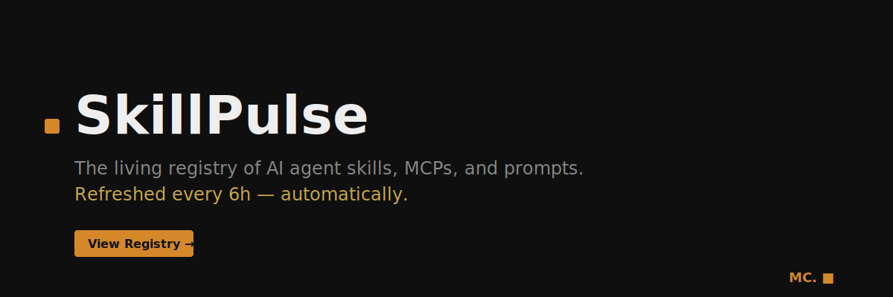

<!-- SKILLPULSE:START -->
<!-- Auto-generated by SkillPulse bot. Do not edit this section manually. -->

<div align="center">



[](https://github.com/corazzione/skillpulse/actions)

[](LICENSE)
[](CONTRIBUTING.md)

**Auto-updated from 7 sources · AI-classified and scored · Submit via issue**

[Browse the live site →](https://corazzione.github.io/skillpulse) &nbsp;|&nbsp;
[Star this repo](https://github.com/corazzione/skillpulse) &nbsp;|&nbsp;
[Submit a skill](https://github.com/corazzione/skillpulse/issues/new?template=submit-skill.yml)

</div>

---

## 🌱 Grow the Registry (New in v1.1)

**Every Claude Code user can now contribute automatically.**

```bash
npx @skillpulse/cli share
```

Scans your `~/.claude/` MCPs and skills, shares them anonymously, makes the registry better for everyone. [Privacy policy](docs/SHARE-YOUR-SETUP.md).

---

## Why SkillPulse?

Awesome lists die. They're manually curated, which means they go stale the moment the maintainer loses interest.

SkillPulse is different: a fully automated pipeline that discovers, classifies, and ranks AI agent skills every 6 hours — no curator bottleneck, no stale data. Every entry is verified, scored, and attributed to its source.

## How It Works

```
[7 Sources] → [Ingest every 6h] → [AI classify + score] → [README + site rebuild]
```

1. **Ingest** — Scrapers poll GitHub, npm, PyPI, HN, Reddit, and Anthropic Registry
2. **Classify** — Claude Haiku categorizes each entry; low-confidence escalates to Sonnet
3. **Score** — Pulse Score 0–100: stars + growth + recency + cross-source + confidence
4. **Publish** — This README and the [live site](https://corazzione.github.io/skillpulse) rebuild automatically

See [METHODOLOGY.md](METHODOLOGY.md) for the full algorithm.

---

## Top Trending

*Data pipeline initializing — check back after first refresh cycle.*

## New This Week

*Launching soon...*

## All-Time Top 30

*Launching soon...*

## By Category

*Launching soon...*

---

## Contributing

Found a skill or MCP not listed? **[Submit it via issue](https://github.com/corazzione/skillpulse/issues/new?template=submit-skill.yml)** — the bot validates and queues it automatically.

See [CONTRIBUTING.md](CONTRIBUTING.md) · [Architecture](ARCHITECTURE.md) · [Methodology](METHODOLOGY.md) · [FAQ](FAQ.md)

---

<div align="center">
<sub>Built by <strong>MC.</strong> ■ &nbsp;·&nbsp; MIT License &nbsp;·&nbsp; <a href="https://corazzione.github.io/skillpulse">corazzione.github.io/skillpulse</a></sub>
</div>
<!-- SKILLPULSE:END -->
